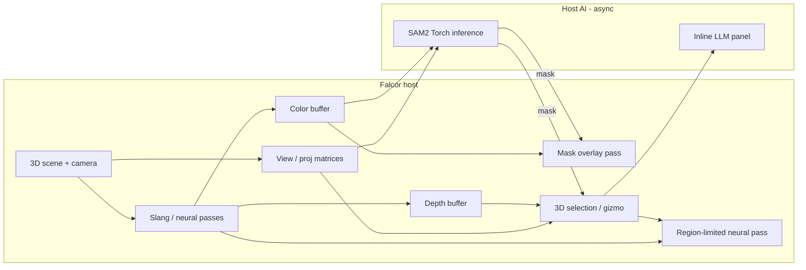

# Plan: Falcor viewport + Segment Anything (inline AI)

**Pinned on:** [docs/roadmap.md](../roadmap.md)  
**Status:** Phase 0 started (fetch + docs + scaffold) — no SAM yet; full mesh viewport is the next coding milestone (Round 2). Round 1 product face: **VERNACULAR** — see [ROUND1.md](../ROUND1.md).  
**Goal:** Hoist Slang neural shading into a real **Falcor** host (**VERNACULAR native**) with 3D meshes, experimental render passes, and viewport-aware AI — starting with **Segment Anything** driven by the live color (and optional depth) buffer.

**Related:** [llm-slang-torch-realtime.md](llm-slang-torch-realtime.md) (host LLM + Torch bridge; Phase 4 of this plan ties the AI panel to that work).  
**Existing host scaffold:** [`native/`](../../native/README.md) — Phase 2 neural BRDF / CoopVec path; Falcor not vendored (fetch via CMake / `scripts/fetch_falcor.ps1`).

---

## Chosen approach (default first path)

**Ship 2D SAM / SAM2 on the Falcor viewport color buffer first.** Optionally use depth (and later normals) to **lift** the 2D mask into a 3D selection (unproject / mesh triangle pick / gizmo). Treat true native **3D SAM** over the viewport as a later research track once the 2D → lift loop is solid.

| Path | When | Why |
|------|------|-----|
| **Default: 2D SAM2 + depth lift** | Phases 2–3 | Mature checkpoints, click/box UX, runs on a single color frame; depth already exists in a deferred/forward Falcor path |
| **Later: true 3D SAM** | After Phase 3 exit | Needs point-cloud / mesh features, different training data, unclear Falcor integration cost |

**Interaction loop (v0):** mouse click or box on viewport → host async SAM2 → mask overlay → optional depth unproject / triangle pick → selection gizmo / region mask for experimental Slang passes.

---

## Context (what exists today)

| Piece | Role today |
|-------|------------|
| `native/` | Scaffold: weight load (`SFMLP001`), `NeuralBrdfPass`, hot-reload, optional train pass — Falcor fetched at build time |
| `python -m slang_falcon.live` / `vernacular` | VERNACULAR 2D pygame / SlangPy curriculum — not a 3D Falcor viewport |
| Phase 2 roadmap | Windows + VS2022, Vulkan SDK, RTX CoopVec for neural BRDF |
| Inline LLM plan | Host-side assist + Torch bridge — planned, not wired into Falcor yet |
| SAM / viewport AI | **Not started** — this plan defines how they land |

Teaching story stays: **teacher → small MLP in shaders → inference in-shader**. SAM and LLM are **viewport / authoring tools**, not replacements for the MLP path.

---

## Hardware & runtime defaults

| Concern | Recommendation (v0 default) | Alternatives |
|---------|------------------------------|--------------|
| Host / renderer | **Falcor** (fetched, not vendored) on Windows + Vulkan | D3D12 Falcor backend if already preferred in local builds |
| Neural shading | Existing CoopVec / scalar MLP path in `native/` | Keep scalar fallback for debug |
| SAM inference | **Local SAM2** via **PyTorch** (CUDA on RTX) | CPU Torch for smoke only; cloud SAM APIs opt-in later (not default) |
| Viewport AI LLM | Align with [llm-slang-torch-realtime.md](llm-slang-torch-realtime.md): local Ollama by default | Cloud API behind explicit opt-in |
| GPU class | **RTX 20xx+** (CoopVec + CUDA Torch for SAM2) | Non-NV: Falcor + scalar MLP; SAM2 CPU/slow or skip |

**Why these defaults:** matches Phase 2 RTX story, keeps playground privacy for AI, and reuses Torch already planned for weight/LLM glue. SAM2 on the color buffer avoids inventing a 3D foundation model before the host can capture and select.

---

## Dependencies (planned)

| Dep | Role | Notes |
|-----|------|-------|
| **Falcor** | Scene, camera, passes, viewport | Via `SF_FETCH_FALCOR` / `native/scripts/fetch_falcor.ps1` — do not vendor |
| **Slang** | Materials / neural / experimental region passes | Already central to repo |
| **PyTorch** (+ CUDA) | Host-side SAM2 inference | Optional extra (e.g. `.[sam]` or `.[torch]`) so base install stays lean |
| **SAM2** (Meta) | Image segmentation from point/box prompts | Pin a known checkpoint + license note in docs when implementing |
| **Vulkan SDK / VS2022** | Native build | Per `native/README.md` |

---

## Non-goals (v0)

- Do **not** implement true native 3D SAM before the 2D + lift path works.
- Do **not** block Falcor frame presentation on SAM or LLM latency — async only.
- Do **not** vendor Falcor or large SAM weights in-repo.
- Do **not** require cloud APIs or API keys for basic viewport + local SAM2.
- Do **not** replace the existing SlangPy curriculum / Phase 1 labs with Falcor-only tooling.
- Do **not** scope multi-object tracking, video SAM, or production DCC plugin packaging in v0.
- Do **not** claim WebGPU (Phase 3) gets SAM or CoopVec — this plan is native Falcor.

---

## Phase 0 — Wire Falcor host (3D scene + Slang)

**Intent:** Turn the `native/` scaffold into a minimal **3D** Falcor app: load Falcor, show a mesh, run a Slang material / neural BRDF pass, keep hot-reload.

### Deliverables

1. Confirm **fetch** path (`FetchContent` / submodule / `scripts/fetch_falcor.ps1`) builds `SlangFalconNative` Release on Windows.
2. **Minimal scene:** camera + one mesh (e.g. sphere or glTF) + lighting; clear viewport.
3. Wire existing **Slang** neural BRDF (or a simple lit Slang material) as a Falcor render pass — reuse `NeuralBrdfPass` / shaders where possible.
4. Document run flags (weights path, scene path) in `native/README.md` when implementing.

### Exit criteria

- App opens a Falcor window with a shaded 3D object; F5 / hot-reload still works for Slang sources of record.
- No SAM yet.

### Progress (this repo)

- [x] `native/scripts/fetch_falcor.ps1` improved (tag pin, `-Force`, checklist)
- [x] Exact Phase 0 commands in `native/README.md`
- [x] CMake discovers `SF_FALCOR_ROOT` / `external/Falcor`; standalone scaffold still builds
- [x] `FalcorPhase0Stub` + `FalcorPhase0App.cpp` sketch (SampleApp not linked yet — Falcor build is multi-GB)
- [x] First green Falcor mesh viewport: `VernacularViewport` + codebook chapters (`native/samples/VernacularViewport/`, `docs/codebook/never_ending_slang.md`)

### Depends on

- [`native/`](../../native/README.md), Vulkan SDK, VS2022, RTX driver as for Phase 2.

---

## Phase 1 — Viewport capture + camera export

**Intent:** Every frame (or on demand), expose **color** and **depth** (optional normals) plus **camera matrices** to the host for AI and lift.

### Deliverables

1. **Color buffer** readback or shared GPU resource (prefer shared / copy-to-staging without stalling the GPU every frame when idle).
2. **Depth** (linear or device depth + params to linearize) aligned to the color resolution.
3. Export **view / proj / invViewProj**, camera position, near/far, viewport size — stable JSON or C++ struct mirrored for Python host helpers later.
4. Debug viz: toggle raw depth as false-color in the UI or a spare pass.

### Exit criteria

- From a paused or live frame, host code can obtain HxWx3 (or 4) color + depth + matrices that unproject a pixel to a world-space ray consistently with the mesh.

### Depends on

- Phase 0 scene + camera.

---

## Phase 2 — Host-side SAM2 (async) + overlay + prompts

**Intent:** Run **SAM2** locally on the captured color image; show the mask in the Falcor viewport; drive prompts from mouse.

### Deliverables

1. **Local SAM2** load (pinned checkpoint); CUDA Torch preferred.
2. **Async inference** queue: click/box → job → mask result; Falcor keeps rendering last frame’s overlay until the next result.
3. **Prompts:** left-click = positive point; modifier + click = negative; drag = box (SAM2 box prompt).
4. **Overlay:** semi-transparent mask (and optional contour) composited in a Falcor pass or ImGui/texture blit — must not destroy depth for Phase 3.
5. Optional: downsample color for SAM (e.g. long edge 1024) and upsample mask back to viewport res.

### Exit criteria

- User clicks an object in the viewport; within interactive latency on RTX, a coherent mask overlay appears on that object in screen space.
- Cancel / busy indicator when inference is in flight.

### Depends on

- Phase 1 color capture; PyTorch + SAM2; RTX CUDA strongly recommended.

---

## Phase 3 — Lift 2D mask → 3D selection

**Intent:** Turn the screen-space mask into a **3D selection** usable by gizmos and later neural passes.

### Deliverables

1. **Depth unproject:** for masked pixels with valid depth, reconstruct world (or view) points; optional point-cloud preview.
2. **Mesh triangle pick:** ray from click through camera; intersect scene mesh; grow selection by mask coverage on projected triangles (or keep seed triangle + mask filter).
3. **Selection representation:** triangle ID set and/or soft region mask texture (object/UV or screen-space) for Phase 5.
4. Simple **gizmo** or highlight on selected mesh subset (bounding box or tint).

### Exit criteria

- Click → mask → selected mesh region (or world AABB) stable enough to feed an experimental pass.
- Document failure modes: sky/background depth, transparent surfaces, TAA jitter (mitigate: capture from a stable/pre-TAA buffer when possible).

### Depends on

- Phase 1 depth + matrices; Phase 2 mask.

---

## Phase 4 — Inline AI panel (viewport-aware)

**Intent:** Host LLM panel that knows **what is selected** and can suggest Slang / scene edits — aligned with [llm-slang-torch-realtime.md](llm-slang-torch-realtime.md) Phases B+.

### Deliverables

1. Side panel or Falcor UI: prompt box; default **local** LLM (Ollama).
2. Context injection: selection summary (mesh name, approx bounds, mask stats), optional thumbnail of cropped color, current Slang entry name.
3. Actions: “explain selection”, “suggest material tweak”, “draft experimental pass stub” — apply only with user confirm; never block the render thread.
4. Shared provider abstraction with the SlangPy live-window plan where practical (same env vars / config).

### Exit criteria

- With a Phase 3 selection, a local LLM reply references viewport context; preview / Falcor frame never waits on the LLM.

### Depends on

- Phase 3 selection; LLM plan Phases A–B patterns; no cloud required by default.

---

## Phase 5 — Experimental Slang neural passes on selected region

**Intent:** Restrict or condition neural / experimental Slang passes to the **selected region** (screen mask or mesh subset).

### Deliverables

1. Pass that samples selection mask / triangle set and runs neural BRDF or a lab experimental kernel only there (elsewhere: teacher or base material).
2. Hook to existing weight load / hot-reload.
3. Optional: feed mask as a texture uniform for stylization / debug heatmaps.

### Exit criteria

- Toggle “neural on selection only” visibly differs from full-frame neural; hot-reload still works.

### Depends on

- Phases 0 and 3; existing `NeuralBrdf` path.

---

## Data flow

---

## Risks

| Risk | Mitigation |
|------|------------|
| Falcor fetch / API churn | Pin Falcor commit; keep thin wrappers in `native/` |
| SAM2 VRAM vs Falcor | Downsample input; run SAM on dedicated CUDA stream; allow “capture once” mode |
| Depth / TAA / transparency break lift | Capture stable depth; document unsupported cases; prefer mesh pick from click seed |
| Async UI races (stale mask) | Tag jobs with frame id; discard outdated results |
| License / weight size for SAM2 | Document download step; do not commit checkpoints |
| Scope creep into full DCC | Keep v0 to one mesh, one selection, one overlay |

---

## Suggested implementation order (when coding starts)

1. Phase 0 build green + mesh on screen  
2. Phase 1 capture + unproject unit test (pixel → world)  
3. Phase 2 SAM2 offline on saved viewport PNG, then live overlay  
4. Phase 3 lift + highlight  
5. Phase 4 panel (can stub with echo context before real LLM)  
6. Phase 5 region neural  

---

## Success snapshot (end of Phase 3)

Developer on RTX Windows: opens Falcor host → clicks a mesh in the viewport → SAM2 mask overlays → depth/mesh lift selects that object region — without waiting on cloud services and without blocking the frame loop.
