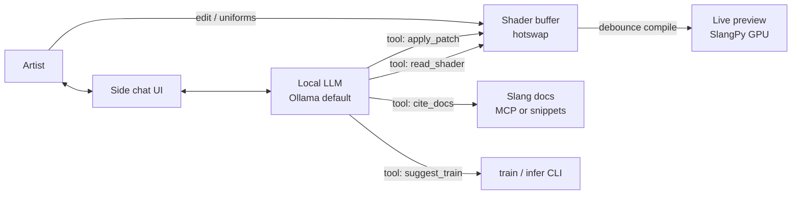

# Plan: VERNACULAR — KodeLife-class live IDE for Slang

**Pinned on:** [docs/roadmap.md](../roadmap.md)  
**Status:** V0 branding in progress — product face **VERNACULAR**; package stays `slang_falcon`; optional `vernacular` CLI alias. No mass rename of imports.  
**Goal:** Productize the existing live playground into **VERNACULAR**: a KodeLife-class live shader IDE for technical artists on the open Slang / neural stack, with a built-in **AI helper** (local small-model chat + Slang docs via MCP or vendored snippets).

**Related:** [live-playground-polish.md](live-playground-polish.md) · [llm-slang-torch-realtime.md](llm-slang-torch-realtime.md) · [falcor-viewport-sam.md](falcor-viewport-sam.md) · [vsynth-feedback.md](vsynth-feedback.md) · [manifesto](../manifesto.md) · [companion parable](../companion/robots_steal_coffee_from_babylon.md) · [ROUND1](../ROUND1.md)

---

## Positioning

**VERNACULAR** = a live coding IDE in the **KodeLife** class, aimed at technical artists, built on **Khronos Slang** and this repo’s neural shading school — not a closed DCC runtime.

| Signal | Meaning |
|--------|---------|
| **Brand** | VERNACULAR — “the living language of the craft”; artists write Slang in the vernacular of modern shading |
| **Class** | KodeLife-like: edit → compile → see (and later hear) immediately; desktop-first mini IDE |
| **Stack** | Open Slang + SlangPy playground + shippable IP ([manifesto](../manifesto.md)) |
| **Programs** | Streamable / syndicable: source and weights you can compile, embed, sell, or give away |
| **Not** | Houdini / Notch lock-in — those are closed ecosystems we learn *from*, not the only place your look can live |

**One-liner:** *KodeLife for Slang — open stack, curriculum, neural path, AI helper that never stalls the preview.*

Package / repo checkout may still say `slang_falcon` / `Slang_Falcon` until an explicit folder rename (manual later — Cursor workspace lock). VERNACULAR is the **product face** (window title, splash, docs, `vernacular` console script).

---

## Already have vs KodeLife

Honest feature map against a KodeLife-class live shader IDE. “We have” means what ships today in `python -m slang_falcon.live` (+ curriculum), not aspirational polish.

| Feature | KodeLife-class | VERNACULAR live today | Gap / note |
|---------|----------------|-------------------------|------------|
| **Live compile** | Edit → instant GPU preview | Yes — save / debounce → temp hotswap → SlangPy recompile | Keep; never regress |
| **In-window editor** | Syntax highlight, undo, multi-file | Yes — side panel, Slang highlight, undo/redo, select, clipboard | Multi-buffer / tabs still missing |
| **Preview** | Fullscreen, resize | Yes — letterbox, dual FS (F11 window / F10 shader-only), shaped Windows chrome, wobble | Chrome pinned; focus → Falcor |
| **Uniforms / time** | Clock, custom uniforms UI | `float time` auto-wired; no general uniform panel | Uniform panel = V1 |
| **Mouse** | Pointer uniforms | ShaderToy-style `mouse` / `mouse_delta` / `mouse_down`; interactive lessons | Good parity for look-around |
| **Lessons / examples** | Built-in snippets | Full curriculum (BoS → Playground → neural → trilogy) | Stronger than KodeLife here |
| **Neural / train path** | Usually none | `train_brdf` / `infer` / in-shader MLP labs | Differentiator — keep adjacent to IDE |
| **Multi-pass graphs** | Pass graph / FBO ping-pong | Single entry → RGB image | V1+ / [vsynth-feedback](vsynth-feedback.md) F0–F1 |
| **Audio reactive** | Spectrum / waveform pins | Not wired (roadmap: audio shaders → PCM) | Pin only in V1; implement later |
| **MIDI** | Controllers → uniforms | None | Post-V1 |
| **Project files** | Save/load project (buffers, settings) | Lesson / single `.slang` path; Save writes buffer to disk | V1 project save |
| **UI polish** | Commercial chrome | Functional mini-IDE; lesson browser / prev-next buttons planned | [live-playground-polish](live-playground-polish.md) |
| **AI helper** | Rare / external | Planned (this product + [LLM plan](llm-slang-torch-realtime.md)) | V2 — core product bet |
| **3D viewport** | Limited / plugin | 2D pygame; Falcor host planned | V3 — [falcor-viewport-sam](falcor-viewport-sam.md) |

**Verdict:** Live compile + editor + preview + time/mouse + curriculum already make this a credible KodeLife *seed*. Gaps are project packaging, multi-pass, audio/MIDI, and IDE chrome — plus the AI helper and Falcor 3D as deliberate later phases.

---

## Phased plan

### V0 — Rename / branding option (no package break)

**Intent:** Ship VERNACULAR as a face without renaming the Python package or repo.

| Deliverable | Notes |
|-------------|--------|
| Window title / caption | e.g. `VERNACULAR — …` beside lesson id |
| Docs + README | This plan pinned; Future one-liner |
| Optional CLI alias | e.g. `python -m slang_falcon.vernacular` → thin wrapper around `live` (or entry-point console script) — **only if trivial** |
| Splash / about string | Manifesto one-liner + link |

**Non-renames:** Keep `slang_falcon`, import paths, CI, and lab IDs. No mass file moves.

**Exit:** A user can say “open VERNACULAR” and land in the same live window; package imports unchanged.

---

### V1 — IDE parity (KodeLife-class core)

**Intent:** Project save, multi-buffer, uniform panel; **pin** audio-reactive on the roadmap (implement when audio shaders land). Builds on polish plan; still pygame / SlangPy 2D.

| Item | Shape |
|------|--------|
| **Project save / load** | Lightweight project file (JSON or folder): main `.slang` paths, entry name, size, lesson id optional, last uniforms. Not a binary lock-in format. |
| **Multi-buffer** | Tabs or buffer list for `#include` / helper modules + main entry; hotswap still compiles from active project roots |
| **Uniform panel** | Inspect entry params beyond `time` / `mouse`; expose float/int/bool (and later textures) with sliders; feed kwargs each frame |
| **Audio-reactive pin** | Document + roadmap stub: FFT / level → uniforms or texture; depends on [Audio shaders](../roadmap.md) host callback — **do not block V1 ship on audio** |
| **Polish carry-in** | Lesson browser, on-screen prev/next ([live-playground-polish](live-playground-polish.md)) |

**Exit:** Artist can save a multi-file Slang sketch, reopen it, tweak uniforms without editing source, and browse lessons in-window.

---

### V2 — AI helper (side chat)

**Intent:** Side panel chat with a **local small model** (Ollama default). Tools read the current shader, apply patches to the hotswap buffer, and cite Slang docs. Preview **never** waits on the LLM.

Aligns with Phase B of [llm-slang-torch-realtime.md](llm-slang-torch-realtime.md); VERNACULAR names the product surface.

| Piece | Default |
|-------|---------|
| **UI** | Side chat (or bottom dock); async stream; cancel button |
| **LLM** | Ollama HTTP, pinned small coding model; cloud OpenAI-compatible behind opt-in |
| **Tools** | See architecture sketch below |
| **Docs** | MCP server for Slang docs **or** vendored / cached doc snippets — cite paths + short quotes in replies |
| **Safety** | Patches apply to buffer / temp hotswap; optional confirm for large diffs; last good compile keeps painting |

**Exit:** User asks “soften the rim light”; model reads buffer, proposes patch, apply → debounce compile; docs citations appear when asked “what does `Differential` mean?”; FPS path unaffected during chat.

---

### V3 — Falcor 3D viewport

**Intent:** Graduate from 2D image preview to the Falcor host with meshes, experimental passes, and viewport AI (SAM2 path). Do not dilute V1/V2 on 3D until the 2D IDE story is solid.

**Full plan:** [falcor-viewport-sam.md](falcor-viewport-sam.md)  
VERNACULAR V3 = product name for that host surface + shared AI panel.

---

## AI architecture sketch

Preview loop and chat are **decoupled**: tools mutate buffers asynchronously; compile stays on the existing debounce / save path.

| Tool (illustrative) | Behavior |
|---------------------|----------|
| `read_shader` | Return current buffer(s) + entry + cursor / selection |
| `apply_patch` | Unified diff or full-file replace → buffer → existing hotswap; never block frame |
| `cite_docs` | MCP query or local snippet index; return short cited excerpts |
| `suggest_train` | Optional: propose `train_brdf` flags / weight path — run is user-confirmed CLI, not silent |

**Hard rule:** Chat / MCP / Ollama latency must not stall `render_frame`. Last good image stays on screen on compile error (already the live spirit).

---

## Non-goals for v1

- **No mass rename** of repo, package, or lab IDs (V0 brand face only).
- **No big rewrite** of `live.py` — incremental surfaces (project, buffers, panel, chat) on the existing hotswap loop.
- **No Falcor / 3D** in V1 (that is V3).
- **No MIDI** in V1.
- **No shipping a full audio engine** in V1 — pin audio-reactive only.
- **No cloud LLM required** for basic IDE or AI helper defaults.
- **No training an LLM inside Slang**; no replacing the BRDF MLP path with “just ask the chat.”
- **No Houdini/Notch-style** proprietary project runtime — project files stay readable Slang + JSON/metadata.
- **No WebGPU live IDE** as V1 scope (Phase 3 demos remain separate).

---

## Success checks (later implementation)

- A technical artist recognizes VERNACULAR as “KodeLife, but Slang + neural school + local AI.”
- Manifesto link is one click from about / README; streamable IP story stays clear.
- V1: save project → quit → reopen → same buffers and uniforms; preview still hot-reloads.
- V2: chat can patch and cite docs without dropping preview frames.
- `slang_falcon` imports and CI remain stable through V0–V1.

---

## Doc pins

| Location | What to add |
|----------|-------------|
| [docs/roadmap.md](../roadmap.md) | Pinned VERNACULAR product plan (this file) |
| [README.md](../../README.md) Future | One-liner linking here |
| [vsynth-feedback.md](vsynth-feedback.md) | Multi-pass / feedback product track (Related + gap row) |
