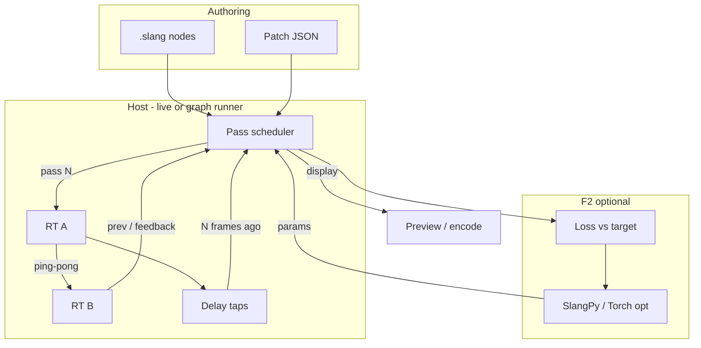

# Plan: Vsynth-style feedback patches

**Pinned on:** [docs/roadmap.md](../roadmap.md)  
**Status:** planning first — optional F0 stub lesson only; no rewrite of `live.py` in this doc’s scope  
**Goal:** Bring **video-feedback / patch-graph** creative coding into VERNACULAR: networks of Slang kernels feeding textures, classic ping-pong feedback, and **differentiable diffusion as trainable feedback** for image/video warps over multidimensional coordinate spaces.

**Related:** [vernacular.md](vernacular.md) · [manifesto](../manifesto.md) · [falcor-viewport-sam.md](falcor-viewport-sam.md) · [llm-slang-torch-realtime.md](llm-slang-torch-realtime.md)

---

## Positioning (VERNACULAR / manifesto)

**VERNACULAR** aims at KodeLife-class live authoring on an **open** Slang / neural stack ([manifesto](../manifesto.md)). Tools like **Notch** and **Vsynth** (and sibling patch/node video systems) show what high-end **feedback art** and modular video graphs look like — we learn *from* that craft.

| Signal | Meaning |
|--------|---------|
| **Respect** | Closed realtime / patch hosts are examples of taste and workflow, not villains |
| **Agency** | Your look should live as readable Slang + JSON graphs + shippable weights — not only inside a proprietary runtime |
| **Differentiator** | Same stack already teaches `[Differentiable]` + SlangPy train loops — feedback params can be **optimized**, not only twiddled |
| **Product face** | Feedback / multi-pass is the natural next IDE surface after single-entry `hello_pixel` (see vernacular V1 “multi-pass graphs”) |

**One-liner:** *Vsynth-style patches, open Slang — feedback networks you can own, and later train.*

Package / repo stays `slang_falcon`. This plan does **not** rewrite the live IDE; it pins phases and a light F0 stub.

---

## Concepts

### Patch graph

| Piece | Role |
|-------|------|
| **Node** | A Slang kernel / entry (image pass, warp, blend, diffuse step, …) |
| **Edge** | A texture or buffer binding (color RT, delay tap, parameter texture) |
| **Graph** | Directed (usually DAG per frame) describing pass order + resource lifetimes |

Artist edits nodes as `.slang`; the host loads a small **JSON graph** and executes passes. Same spirit as Vsynth/Notch patches, without a closed project binary.

### Classic video feedback

Each frame:

1. Read previous output (or a delayed tap)
2. Apply a **transform** (scale, rotate, offset, UV warp)
3. **Blend** with new content (feedback amount / decay)
4. Write to the opposite of a **ping-pong** render target pair

Uniforms: `feedback`, `zoom`, `angle`, decay, mix with camera/input. Tiny change → organic trails and recursive geometry.

### Feedback networks

Beyond one loop:

- Multi-pass **DAG**: A → B → C, with optional cycles via **delay taps** (read N frames ago)
- Shared buffers between branches (blur → warp → composite)
- Host owns scheduling; shaders stay pure kernels

### Differentiable diffusion as *trainable* feedback

Treat warp / diffusion / blend parameters as **trainable**:

- Mark warp / loss math `[Differentiable]`
- Forward: apply feedback / diffusion step(s) toward a manipulated image or video frame
- Backward: Slang autodiff + SlangPy / Torch optimize params against a **target** (still, style frame, or trajectory)
- Result: feedback art that can *fit* a look — same school as BRDF MLP labs, applied to coordinate warps and recursive image operators

### Multidimensional coordinate warps

Feedback is often “wrong UVs on purpose”:

| Space | Use |
|-------|-----|
| **UV** | Classic 2D feedback / zoom spiral |
| **Polar** | Radial trails, kaleidoscope taps |
| **Domain warping** | Nested `f(p + noise(p))` before sampling previous frame |
| **3D + time as 4D** | `(x,y,z,t)` or `(u,v,layer,t)` for volumetric / slice feedback and video warps |

Coordinate choice is a first-class node type in the patch graph, not a one-off trick in a single shader.

---

## Context (what exists today)

| Piece | Role today |
|-------|------------|
| `python -m slang_falcon.live` | Single entry → RGB image; `time` / mouse; **no** previous-frame texture / ping-pong |
| Curriculum | BoS → playground → neural / autodiff — no feedback track yet |
| VERNACULAR | Multi-pass / FBO ping-pong listed as gap ([vernacular.md](vernacular.md)) |
| Autodiff path | `[Differentiable]` labs + `train_brdf` / SlangPy — reusable for F2 |

**F0 honesty:** True ping-pong needs a **small** live extension (two buffers, bind previous as input). Until then, a stub can only **simulate** trails with time-based stamps (same compromise as playground painting port).

---

## Phased plan

### F0 — Single ping-pong feedback lesson

**Intent:** One live lesson: two buffers (or documented host hook), transform + blend, `feedback` uniform.

| Deliverable | Notes |
|-------------|--------|
| Lesson `feedback/fb01_pingpong` | Markdown + `.slang` |
| Host hook | Prefer: live holds A/B RTs, passes previous frame (texture or buffer) into entry — **small** extension, not IDE rewrite |
| Stub now | Time-trail simulation if ping-pong not wired yet (see [labs/feedback/](../../labs/feedback/)) |

**Exit:** Artist sees recursive trails; tweaking feedback amount changes persistence. True RT ping-pong when live binds previous frame.

---

### F1 — Patch JSON graph runner

**Intent:** Load a graph file, compile nodes, execute passes in order, wire textures.

```text
{
  "nodes": [
    { "id": "gen", "shader": "…", "entry": "hello_pixel" },
    { "id": "fb",  "shader": "…", "entry": "feedback_pass", "inputs": { "prev": "fb" } }
  ],
  "output": "fb"
}
```

| Item | Shape |
|------|--------|
| JSON schema | Nodes, entries, edge → buffer names, size, clear policy |
| Runner | Python: topo order + delay-tap bookkeeping; SlangPy dispatch per node |
| Live integration | Optional: open graph from VERNACULAR project (after V1 project save) |

**Exit:** Two+ Slang passes feed each other from one JSON file without hand-rolling Python per sketch.

---

### F2 — Diffusable / trainable feedback

**Intent:** Optimize feedback / warp / diffusion params against a target.

| Piece | Shape |
|-------|--------|
| Forward | Differentiable warp + blend (or multi-step diffusion-like update) |
| Loss | Image / video-frame L2 (or perceptual later) vs target |
| Train | SlangPy `.bwds` or Torch bridge ([llm-slang-torch-realtime](llm-slang-torch-realtime.md) Phase A) |
| UX | “Fit this still” button / CLI — not silent training inside the preview loop |

**Exit:** A feedback amount / warp field converges so the recursive look matches a reference.

---

### F3 — Video I/O + audio-reactive (later)

**Intent:** Decode frames in → graph → encode out; drive uniforms from spectrum / level.

Depends on [Audio shaders](../roadmap.md) host callback for reactive pins. Do not block F0–F2 on video codecs or audio engines.

---

### F4 — Falcor multi-pass (when 3D host exists)

**Intent:** Same patch ideas as Falcor render-graph / experimental passes once [falcor-viewport-sam](falcor-viewport-sam.md) Phase 0+ lands. VERNACULAR V3 product surface shares vocabulary (nodes, taps, region masks).

---

## Data flow



Classic feedback is the A ⇄ B loop. Networks add more nodes and delay edges. Trainable feedback closes the loop through loss → optimized uniforms / warp fields.

---

## Non-goals (this plan’s scope)

- **No** full rewrite of `live.py` / VERNACULAR chrome — F0 is a small buffer bind or a simulated stub.
- **No** Notch/Vsynth file-format compatibility or proprietary runtime clone.
- **No** shipping a video codec stack or full audio engine in F0–F2.
- **No** blocking F0 on Falcor (that is F4).
- **No** training an LLM to “be” the feedback; autodiff is on shader params.

---

## Success checks (later implementation)

- F0: feedback amount visibly changes trail persistence in live.
- F1: JSON graph with ≥2 passes runs without custom Python per patch.
- F2: warp/feedback params move loss down toward a target still.
- Docs: manifesto tone preserved — closed tools named respectfully; open stack stays the path to shippable IP.
- `slang_falcon` imports and CI remain stable.

---

## Doc pins

| Location | What to add |
|----------|-------------|
| [docs/roadmap.md](../roadmap.md) | Pinned Vsynth-style feedback plan (this file) |
| [README.md](../../README.md) Future | One-liner linking here |
| [vernacular.md](vernacular.md) | Related link; multi-pass gap points here |

---

## Stub (optional F0)

See [`labs/feedback/`](../../labs/feedback/) — `fb01_pingpong` simulates feedback trails with time-based stamps until live grows ping-pong RTs. True F0 exit criteria still require the small host extension above.
